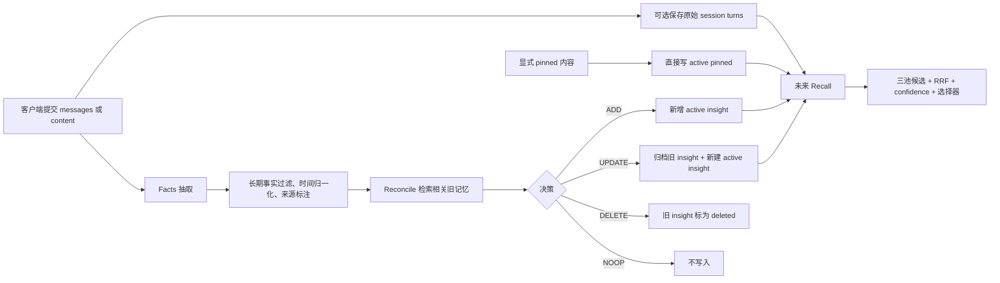

# MEM9 记忆算法中文导读

本文档集解释 MEM9 当前实现中的四条核心链路：Recall、Facts 抽取、Reconcile 和记忆持久化。它们共同组成“把一次对话变成可长期检索的记忆，再在未来召回”的闭环。

## 阅读顺序

1. [Facts 抽取流程](facts-extraction.zh-CN.md)：先理解系统如何从消息中识别可长期保存的原子事实。
2. [Reconcile 流程](reconciliation.zh-CN.md)：再理解新事实如何与已有记忆比较，并被判定为 ADD、UPDATE、DELETE 或 NOOP。
3. [记忆存入流程](memory-storage.zh-CN.md)：接着理解 session、pinned、insight 三类记录最终如何写入 TiDB。
4. [Recall Algorithms](recall.zh-CN.md)：最后理解查询如何从 pinned、insight、session 三个候选池中召回、融合、评分和截断。

## 一眼看懂四条链路

## 三种记忆的职责

| 类型 | 含义 | 主要写入路径 | Recall 中的角色 |
| --- | --- | --- | --- |
| `session` | 原始对话 turn，保留上下文与相邻消息 | `SessionService.BulkCreate` | 回答事件、原话、时间和上下文问题 |
| `insight` | 从对话或 content 中提炼出的长期事实 | Facts 抽取 + Reconcile | 回答稳定事实、偏好、关系、项目和配置问题 |
| `pinned` | 用户显式要求固定保存的内容 | `MemoryService.CreatePinned` | 高优先级但仍受置信度与数量上限约束 |

## 文档依据与边界

本文档依据本机 MEM9 仓库 `8a6d5c236b121283ea48de783bcb1b0e31e24638` 源码快照编写，主要覆盖 `server/internal/handler`、`server/internal/service` 和 `server/internal/repository/tidb`。源码仓库仍是算法事实的权威来源；本文档是面向理解和运维排障的解释层，不替代 API 契约或源码测试。

本文档描述的是应用算法与数据库语义，不代表某一时刻生产环境的配置、特性开关或实时健康状态。
