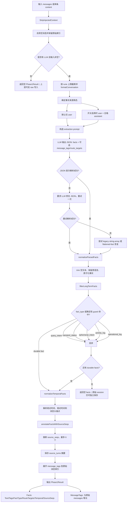

# MEM9 Facts 抽取流程

Facts 抽取的目标不是总结整段对话，而是从允许的消息角色中生成可独立检索、适合长期保存的原子事实，并为每个事实附加 tags、时间语义、来源 turn 和可选的 Space Chain 路由目标。

## 详细流程图



## 1. 输入预处理

Handler 驱动的消息管线首先调用 `StripInjectedContext`，移除插件注入的 `<relevant-memories>...</relevant-memories>` 内容，避免把上一次召回结果再次写回数据库而形成反馈环。

`prepareExtractionInputWithPolicy` 会跳过空消息、规范化 role 和 content，并记录清洗后消息对应的原始索引。格式化后的对话最多保留 1,000,000 个 rune；单条 `content` 入口在包成 `User:` 消息前最多保留 32,000 个 rune。

## 2. 哪些消息可以成为事实来源

默认策略只从 `user` 消息抽取事实，`system` 和 `tool` 永远不参与事实抽取。启用 `includeAssistantFacts` 后，`assistant` 只允许贡献关于用户世界、项目、系统、决策或已确认结果的具体长期断言，不能把建议、猜测、提问或自我描述当作用户事实。

这一规则只约束 facts；`message_tags` 仍然会为 user、assistant、tool、system 的每条消息生成对应位置的标签。

## 3. LLM 抽取契约

每个事实应是单一、自包含、可独立检索的陈述。因果、条件、先后等语义强依赖的内容允许保留为一个事实，避免拆开后丢失关系。

抽取器要求保留原始语言、具体名称和时间表达，尽量把明确指代替换为实体名，但不得猜测不清楚的指代。每个事实可带 1–3 个短 lowercase tags；启用 Space Chain 时还可带零个或多个 `route_targets`，但路由信息不能混入 tags。

LLM 必须返回 JSON。首次解析失败时会发起一次 JSON 修复重试；仍失败后，服务会尝试兼容旧的 `{"facts":["..."]}` 格式，以及把事实字段错误展开到顶层的 flattened-fact 格式。无法恢复时，Phase 1 返回错误。

## 4. 长期事实过滤

系统使用两层门禁。第一层是 prompt，让模型只产生 durable facts；第二层是服务端 `filterLongTermFacts`，对输出做确定性兜底。

以下类型会被丢弃，不进入 Reconcile：

- `query_intent`：用户只是提问、搜索或要求解释。
- `transient_status`：当前短暂状态，例如“现在正在健身”。
- `ephemeral_intent`：一次性意图或请求，例如临时监控、记录一顿饭。
- `activity_log`：单次饮食、体重、训练、睡眠等自我记录。
- `operational_log`：调试、任务、导入、运行状态、临时工作区等日志。

服务端还用中英文正则检测部分短期意图和日志。普通人物、地点、关系、项目、旅行、事件或承诺，不应仅因为包含“今天/明天/吃过/计划”等词就被过滤；带同伴或社会关系线索的叙事事件也会避免被简单当作 activity log。

## 5. 时间归一化

抽取文本保持自然语言时间，不把 `[time: ...]` 直接写进正文。后处理将时间解析为 metadata 中的 `TemporalMetadata`：`kind`、`anchor_source`、`granularity`、`resolved_start`、`resolved_end` 和 `display`。

归一化会区分显式绝对时间、本句锚定的相对时间、消息头锚定的相对时间，以及以当前时间为锚的指示性相对时间。Recall 或 Reconcile 需要匹配时，`TemporalRecallProjection` 才临时把 `display` 投影成只读的 `[time: ...]` 后缀。

## 6. 来源追踪

每个事实会获得 `source_seqs` 和 `source_turns`。若 LLM 没有直接返回来源序号，服务会根据事实文本与允许来源消息之间的 token 重合度推断，最多保留 6 个来源序号，再把对应 role/content 写入 metadata。

这一设计让最终 insight 能够追溯到原始对话，同时让 Reconcile 改写后的文本仍可通过相似 token 重新关联到最可能的来源 facts。

## 7. 空结果与失败语义

“没有 durable facts”是正常结果，不是错误。原始 session turns 仍可能已被保存，长期 insight 则不会创建。

LLM 不可用时，`ExtractPhase1` 返回空结果；`IngestService.Ingest` 的 raw 模式或无 LLM 模式会改走整段原文直接写 insight 的路径。对于明确要求 Reconcile 的 `ReconcileContent`，无 LLM 会返回校验错误，不会悄悄降级成 raw 写入。

## 8. 核心伪代码

```text
cleaned = stripInjectedContext(messages)
input = prepare(cleaned, allowed_roles, rune_limit)
if llm == nil or input.empty: return empty

raw = llm.extract(input, routing_targets)
parsed = parse_or_retry_or_recover(raw)
facts = trim_and_normalize(parsed.facts)
facts = keep_only_durable_facts(facts)
facts = normalize_temporal_metadata(facts)
facts = attach_source_seqs_and_turns(facts, input.messages)
message_tags = expand_to_original_indices(parsed.message_tags)
return facts, message_tags
```

## 9. 源码定位

- `server/internal/handler/memory.go`: `ingestMessages`，消息入口、session 保存、Phase 1 与 Phase 2 编排。
- `server/internal/service/ingest.go`: `ExtractPhase1WithRouting`、`extractFactsWithRouting`、`extractFactsAndTagsWithRouting`、`finalizeExtractedFacts`、`filterLongTermFacts`。
- `server/internal/service/temporal_fact.go`: 时间归一化与 Recall 投影。
- `server/internal/service/source_provenance.go`: `source_seqs`、`source_turns` 的推断和 metadata 写入。

## 10. 排障检查点

- facts 为空时，先区分“源角色不允许”“LLM 输出为空”“全部被长期事实门禁过滤”与“JSON 无法恢复”。
- session 中有原话但 insight 中没有，并不必然是故障；这可能是过滤器按设计丢弃了短期内容。
- 检查 `fact_type` 与 server guard 的过滤指标，避免仅根据最终数据库行数判断抽取失败。
- 时间问题应同时查看正文、temporal metadata 与 Recall 时的投影，不能只搜索正文中的绝对日期。
