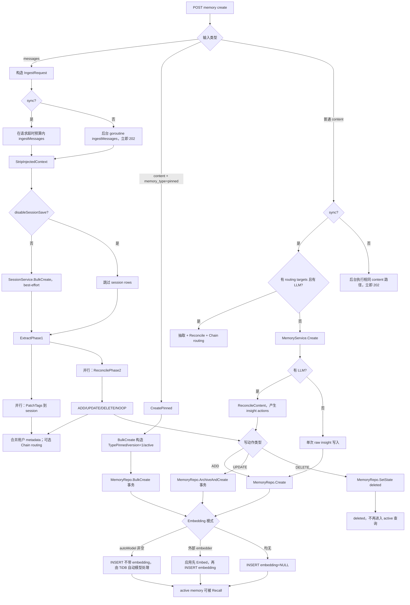

# MEM9 记忆存入流程

MEM9 的“存入”不是单一路径。客户端可以提交 `messages`、普通 `content` 或显式 `pinned content`；系统会分别保存原始 session、经过 Reconcile 的 insight，或用户固定的 pinned，并根据嵌入模式决定由应用生成向量还是交给 TiDB 自动嵌入。

## 详细流程图



## 1. 消息入口：同时形成 session 与 insight

`messages` 路径由 Handler 的 `ingestMessages` 编排。第一步先清除注入的 relevant memories；随后若未设置 `disableSessionSave`，调用 `SessionService.BulkCreate` 保存每一个原始 turn。

Session 保存是 best-effort。即使 session bulk insert 失败，Facts 抽取与 Reconcile 仍会继续；因此 `sync=true` 只保证抽取/Reconcile 已完成，不保证 `/session-messages` 中一定存在所有原始行。当前 `BulkCreate`、PatchTags 和 Reconcile 也没有被一个总事务包住。

Phase 1 返回后，系统并行执行两件事：把 `message_tags` patch 回对应 session rows；把 facts 交给 `ReconcilePhase2` 产生 insight 变化。两者完成后，可选执行 Space Chain 路由，并把用户 metadata 合并到新创建的 insights。

需要特别注意当前入口差异：Handler 的 `messages` 路径直接调用 `ExtractPhase1WithRouting`，不会根据请求中的 `mode` 切换到 `IngestService.Ingest`。因此在该路径没有 LLM 时，Phase 1 返回空 facts，通常只留下 session rows；`ModeRaw` 或无 LLM 时把整段对话直接写成 raw insight 的行为属于 `IngestService.Ingest` 自身的另一条调用路径。

## 2. 普通 content 入口

普通 `content` 不允许携带 ingest `mode`。有 LLM 时，`MemoryService.Create` 调用 `ReconcileContent`，把 content 包成单条 user 消息进行 Facts 抽取和 Reconcile；同一 content 可能生成零条、一条或多条 insight。

无 LLM 时，普通 content 走可预测的单写路径：校验输入、可选生成外部 embedding、构造一条 `TypeInsight`、`active`、`version=1` 的记录并调用 `MemoryRepo.Create`。它不会先写入再 patch tags/metadata，避免第二次写失败后 API 报错但内容已经落库。

如果 content 位于带路由规则的 Space Chain 且 LLM 可用，Handler 会先抽取带 `route_targets` 的 facts，再对源 Space 和目标 Spaces 分别 Reconcile。用户 tags/metadata 在这些动作完成后再合并到创建出的 insights。

## 3. 显式 pinned 入口

显式 `memory_type` 当前只接受 `pinned`。`CreatePinned` 调用 `BulkCreate`，直接构造 `TypePinned`、`active`、`version=1` 的记录，不经过 Facts 抽取或 Reconcile。

Pinned bulk create 在一个数据库事务内执行，任意一条 insert 失败会回滚整批。单次 CreatePinned 目前也是复用这个批量事务，只是 items 数量为 1。

## 4. Insight 的三种写动作

ADD 调用 `MemoryRepo.Create`，新记录使用 UUID、`TypeInsight`、`active`、`version=1`，并保存 source、agent、app、session、tags、temporal/source/external provenance metadata。

UPDATE 使用 append-new + archive-old：先生成新 UUID，在 `ArchiveAndCreate` 单事务内将旧 active 记录改为 `archived`、写入 `superseded_by`，再 insert 新 active insight。它不是原地覆盖，也不继承旧行的 version 序列；新行从 version 1 开始。

DELETE 将目标 active insight 的 state 改为 `deleted`，属于软删除。Pinned 不允许被自动 Reconcile 删除；显式 API 删除则由 `SoftDelete` 加行锁后幂等更新。

## 5. 嵌入向量的三种模式

| 模式 | 写入行为 | Recall 行为 |
| --- | --- | --- |
| `autoModel != ""` | INSERT 省略 `embedding` 列 | 使用 TiDB `AutoVectorSearch(queryText)` |
| 外部 `embedder != nil` | 应用先生成 `[]float32` 并写入 embedding | 查询也先 Embed，再 `VectorSearch` |
| 两者都没有 | embedding 为空 | 降级为 FTS 或 LIKE keyword |

在 autoModel 模式下，应用层不应自行写 embedding；在外部 embedder 模式下，content 发生变化时必须重新生成向量。数据库向量搜索只考虑 `embedding IS NOT NULL` 的 active 记录。

## 6. 普通 API Update 与 Reconcile UPDATE 的区别

普通 `MemoryService.Update` 是原地更新同一 ID：读取当前 active 记录、修改 content/tags/metadata、必要时重算 embedding，再调用 `UpdateOptimistic`，SQL 将 `version = version + 1`。虽然接口接受 `If-Match`，当前服务检测到版本不一致时记录 LWW warning，但实际调用 repository 时传入 expectedVersion=0，因此不会用 SQL 条件拒绝这次写入。

Reconcile UPDATE 则使用版本链：旧 ID 归档，新 ID 创建。排障时必须先确认是哪一种 UPDATE，否则会误判 ID 变化或 version 变化。

## 7. 同步、异步与副作用

`sync=true` 在请求上下文和较长超时预算内完成 ingest，并返回最终状态；异步路径先完成配额预留，启动后台 goroutine 后返回 HTTP 202。后台失败只记录日志并执行失败计量，客户端不能从初始 202 判断最终是否产生 insight。

成功写入后还会执行 runtime usage finalize、webhook enqueue 和后续成功处理。应用写入已经成功但计量 finalize 失败时，HTTP 层可能返回错误；排障必须同时检查数据库、usage operation 和 webhook，而不能仅以响应码推断是否落库。

## 8. 原子性边界

| 边界 | 是否原子 | 说明 |
| --- | --- | --- |
| 一批 pinned `BulkCreate` | 是 | 单 TiDB 事务 |
| 一次 insight UPDATE | 是 | archive old + create new 单事务 |
| 一次显式 soft delete | 是 | 行锁 + update + commit |
| 整个 messages ingest | 否 | session save、tag patch、多个 Reconcile actions 分开 |
| 一批 Reconcile actions | 否 | 每个 ADD/UPDATE/DELETE 独立执行，允许 partial |
| 写入与 runtime usage/webhook | 否 | 属于后置协调，不和 memory SQL 共事务 |

## 9. 核心伪代码

```text
if request.messages:
  clean(messages)
  best_effort_save_session_turns()
  facts, message_tags = extract_phase1()
  parallel(
    patch_session_tags(message_tags),
    reconcile_phase2(facts)
  )
  route_chain_and_merge_metadata()

else if request.memory_type == pinned:
  bulk_create_transaction(type=pinned)

else if request.content:
  if llm: extract_and_reconcile_as_insight()
  else: create_one_raw_insight()

write(ADD)    = insert_active()
write(UPDATE) = transaction(archive_old(), insert_new_active())
write(DELETE) = set_state_deleted()
```

## 10. 源码定位

- `server/internal/handler/memory.go`: create handler、同步/异步路径、`ingestMessages`、Chain routing 和 post-success 操作。
- `server/internal/service/session.go`: 原始 session turns 的 `BulkCreate` 与 tags patch。
- `server/internal/service/memory.go`: `Create`、`CreatePinned`、`Update`、`Delete`、`BulkCreate`。
- `server/internal/service/ingest.go`: insight 的 `addInsight`、`updateInsight` 与 Reconcile delete。
- `server/internal/repository/tidb/memory.go`: SQL insert、optimistic update、soft delete、bulk transaction、`ArchiveAndCreate`。

## 11. 排障检查点

- 收到 202 只说明异步任务已接受，必须继续验证最终数据库行、日志和计量 finalize。
- session 缺行但 insight 存在，可能是 best-effort session bulk save 失败；反过来 session 存在但 insight 没有，可能是无 durable facts 或 Reconcile warning。
- UPDATE 后要沿 `superseded_by` 检查新旧链，不要只查旧 active ID。
- embedding 为空时先确认部署使用 autoModel、外部 embedder 还是 keyword-only 模式；autoModel 下 INSERT 不带 embedding 是预期实现。
- 多条事实部分成功时，检查 `Changes` 和 `Warnings`，不要假设整个 ingest 事务回滚。
