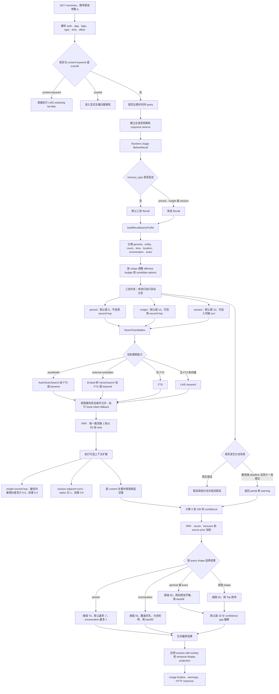
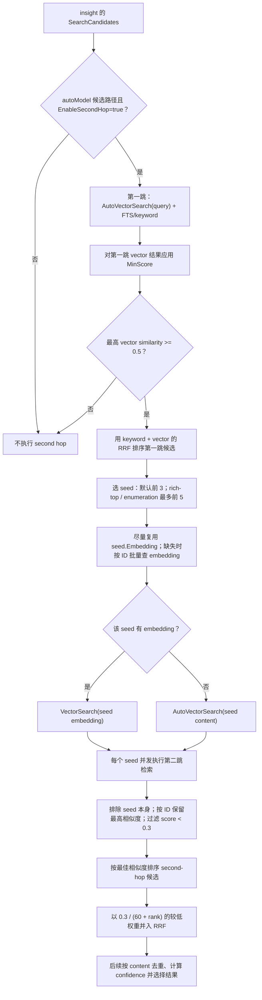

# MEM9 Recall Algorithms

MEM9 Recall 不是简单的向量 Top-K。默认查询会同时从 pinned、insight、session 三个池构造候选，通过 FTS/keyword 与 vector 的 RRF 融合、查询形状特征、答案证据、来源先验和覆盖策略计算置信度，再选择最终结果。

## 详细流程图



## 1. Handler 分流

`listMemories` 首先规范化 limit 和 offset，解析 app、tags、source、state、memory type、agent、session、排序和时间范围。默认 limit 为 10，最大 200；`created_after/created_before` 只允许用于 `memory_type=session`，避免混合查询中只有 session 被时间过滤。

只有非空 `q` 且不是 content keyword list filter 时才进入 Recall 预算、计量和置信度算法。显式 content keyword 路径故意绕开向量、FTS 和 Recall 排名，用 LIKE 作为 UI 内容过滤；`scanAll` 也走独立路径。

未指定 `memory_type` 时进入默认三池 Recall；指定 `pinned`、`insight` 或 `session` 时进入单池置信度 Recall。没有 query 时只是普通 list，不运行下述算法。

## 2. Query Profile 与查询形状

系统先构造 `recallQueryProfile`，识别中英文查询中的时间、地点、数量、人物、列举、精确问句、目标 speaker、时态、持续时间、频率、视觉内容和引号文本等信号。

主 shape 有七类：

| Shape | 典型问题 | 选择重点 |
| --- | --- | --- |
| `general` | “关于我的部署偏好” | insight/session 平衡，允许关键词证据加成 |
| `entity` | “谁负责 X？” | 候选中实体证据 |
| `count` | “有多少个？” | 数值和计数证据 |
| `time` | “什么时候发生？” | 时间 token、过去/未来一致性 |
| `location` | “在哪里？” | 地点实体和位置表达 |
| `enumeration` | “有哪些项目？” | 覆盖不同答案，不只追逐最高分 |
| `exact` | “什么是 X？” | 文字、标识符和直接答案证据 |

Enumeration 会把有效返回预算扩大为 `min(requested_limit * 2, 20)`，并增加 insight/session 候选数、fetch multiplier、second-hop seeds 和相邻 session turns，以提高列举完整性。

## 3. 三个候选池

默认三池并发执行：pinned 默认候选 5 条、insight 10 条、session 10 条。Pinned 不启用 second hop；insight 可启用 second hop；session 可加入相邻 turn。

三池使用独立 branch context。任何“真实错误”会取消其他分支并让请求失败；如果只是服务端 Recall deadline，且至少一个分支已成功，系统可以返回已有分支结果并附 partial warning。客户端取消等非服务端原因仍会终止请求。

## 4. 每个池内部如何搜候选

`SearchCandidates` 按能力选择四种策略：

1. 配置 TiDB auto embedding 时，使用 `AutoVectorSearch(query text)` 加 FTS/keyword。
2. 配置外部 embedder 时，先对 query 生成 embedding，再执行 `VectorSearch` 加 FTS/keyword。
3. 无向量能力但 FTS 可用时，只执行 FTS。
4. 两者都不可用时，降级为 LIKE keyword。

默认 fetch limit 是最终池 limit 的 3 倍；rich-top 和 enumeration 使用 4 倍。向量结果应用最低相似度过滤。向量与关键词都为空且 query 适合拆词时，会对去停用词后的 loose tokens 做逐词 keyword fallback，再按 token 命中数和更新时间排序。

TiDB 向量查询只检索 embedding 非空的 active 记录。`VEC_COSINE_DISTANCE` 或 auto 版本的距离表达式必须在 SELECT 与 ORDER BY 中保持字节一致，才能利用 TiDB VECTOR INDEX。

## 5. RRF 融合

关键词/FTS 列表和向量列表使用 Reciprocal Rank Fusion 合并：

```text
RRF(id) = Σ 1 / (60 + rank_leg(id))
```

这里 `rank` 从 1 开始。一个候选同时在 keyword 和 vector 两路出现时，两项相加；单路第一名约为 `1/61`，两路第一名的理论基准上限为 `2/61`。候选会保留 `InVector`、`InKeyword`、`VectorSimilarity`、`RRFScore`、`RRFRank` 和来源池，供后续置信度计算。

## 6. 二跳与相邻 turn 扩展

Insight 的 second hop 只在 **autoModel 候选路径**且 handler 为 insight 分支**显式启用** `EnableSecondHop` 时运行；外部 embedder、仅 FTS/keyword、pinned 和 session 候选路径都不会执行它。第一跳向量结果中的最高相似度必须至少为 `0.5`，才被视为足够强的语义锚点；低于该门槛会跳过扩展，避免从弱命中扩大噪声。

### Insight second hop 独立流程图



second hop 是一次**间接的向量近邻扩展**，不是显式图数据库的边遍历：系统没有存储或查询“seed 与 neighbor 的关系边”。它先把第一跳 keyword/FTS 与 vector 结果用 RRF 排序，默认从该排序的前 3 条取 seed；对 `general`/`exact` 的 rich-top 以及 `enumeration`，handler 会将 `SecondHopTopN` 提高到 5。候选不足时只取实际数量。

启动条件同样有两层：`autoHybridCandidates` 只在 `opts.EnableSecondHop` 为真时考虑二跳，而 `SearchCandidates` 只有在 `autoModel != ""` 时才会调用该函数；随后它检查已应用最小分数过滤后的第一跳 vector 结果，要求最高 `Score >= 0.5`。所以 FTS/keyword 命中本身不能触发二跳，也不会因为 RRF 排名高而绕过向量语义锚点。

`secondHopAutoSearch` 先按第一跳 RRF 分数排列 seed。它优先使用 seed 已携带的 `Embedding`；对缺 embedding 的 seed，若仓库实现 `GetEmbeddingsByID`，便按 ID 批量回填。回填失败或接口不可用时，不中断召回：该 seed 退回使用其 `Content` 作为 `AutoVectorSearch` 的查询文本。因此“自动向量检索”只是 seed embedding 的回退路径，不是对每个 seed 都重复生成向量。

每个 seed 启动一个 goroutine 进行第二跳向量检索：有 embedding 时调用 `VectorSearch(seed.Embedding, filter, limit)`，否则调用 `AutoVectorSearch(seed.Content, filter, limit)`。收集结果时排除所有 seed ID；相同候选 ID 只保留最高相似度的版本；`Score < 0.3` 的候选被丢弃（无 score 的结果按 `0` 参与“最佳”比较）。最后按保留的最佳相似度降序形成单一列表。

该列表不会被当作直接命中等权对待。合并时第 `rank` 个 second-hop 候选仅增加 `0.3 / (60 + rank)` 的 RRF 分数，低于 keyword/vector 主路径的 `1 / (60 + rank)`；后续仍会应用类型权重、按 content 去重、置信度计算和最终选择。这样它只补充由强第一跳锚点引出的可能相关记忆，不能被表述为确定的、已存储的关系。

Session 的 adjacent turns 从高排名 seed 出发，在相同 app/session 中按 seq 取半径 1 的上下文，默认最多围绕 4 个 seed；列举查询可以扩大到 12 个。相邻结果以 0.8 权重加入融合，让回答不仅看到命中的一句，还能看到它前后的对话语境。

## 7. Confidence 评分

每个候选最终得到 0–100 的整数 confidence。核心结构为：

```text
confidenceRaw =
  0.55 * clamp(RRF / (2/61))
  + 0.20 * clamp((vectorSimilarity - 0.30) / 0.70)
  + agreementBonus
  + literalContentEvidenceBonus
  + keywordContentEvidenceBonus
  + recencyBonus
  + answerEvidenceBonus
  + sourcePrior

confidence = round(clamp(confidenceRaw, 0, 1) * 100)
```

其中 vector 与 keyword 同时命中加 0.10；长标识符原文命中可加 0.35，一般长 literal 可加 0.22；更新时间 7 天内可加 0.05、30 天内可加 0.02。`answerEvidenceBonus` 根据 shape 检查实体、时间、地点、数字、speaker、视觉描述等答案证据；`sourcePrior` 让 session 更适合 exact/事件语境，让 insight 更适合稳定的一般事实。

Confidence 不是纯余弦相似度，也不是 LLM 评分；它是确定性特征组合。排障时必须同时看 RRF、vector、keyword、答案证据和来源池。

## 8. 最终选择策略

Pinned 先选，默认 confidence 至少 70 且最多保留 2 条；enumeration 最多保留 1 条。强 identifier literal 命中可能直接占用全部预算。

General/exact 使用跨 insight/session 的平衡选择：先做两轮覆盖不同来源池，再按分数 backfill；如果后续候选比当前最佳候选低 18 分以上，会触发 confidence gap 截断。

Entity/count/time/location 等其他非列举 shape 使用 confidence 至少 65 的 Top 排序，并应用默认 18 分 gap 截断。

Enumeration 使用更低的 55 阈值和 coverage-first 策略，根据答案 focus/coverage token 与来源桶轮转选择，再 backfill。它优化的是“覆盖更多不同答案”，因此返回数量可能超过调用者原始 limit，但不超过扩展后的最大预算 20。

所有路径最后按 content 去重；content 为空时退回 ID。冲突候选优先保留 confidence 更高者，再用来源偏好、更新时间和 ID 稳定决胜。

## 9. 响应前处理与观测

召回完成后，session 结果会应用 edit overlay，时间型 query 会把结构化 temporal metadata 投影成可读显示。随后 runtime usage finalize、计量和 HTTP 写响应在预留的 response budget 中执行。

日志会记录 query shape、selection mode、requested/effective budget、各池候选与选中数量、coverage/backfill、cutoff reason、三分支耗时和 outcome、partial 状态以及总耗时。这些字段比单一 HTTP 状态更适合定位“慢在候选检索还是慢在选择/响应”。

## 10. 核心伪代码

```text
profile = classify_and_profile(query)
budget = effective_budget(profile.shape, requested_limit)

parallel:
  pinned  = search_candidates(type=pinned, second_hop=false)
  insight = search_candidates(type=insight, second_hop=true)
  session = search_candidates(type=session, adjacent_turns=true)

for pool in [pinned, insight, session]:
  candidates = keyword_or_fts + vector
  candidates = rrf_merge(k=60)
  candidates += optional_second_hop_or_adjacent_context
  candidates = dedupe_by_content(candidates)
  candidates = deterministic_confidence(candidates, profile)

selected_pinned = select_pinned(confidence>=70, max=2)
selected_mixed = profile.enumeration
  ? select_for_coverage(confidence>=55)
  : select_balanced_or_top(confidence>=65, gap_stop=18)
return selected_pinned + selected_mixed
```

## 11. 源码定位

- `server/internal/handler/memory.go`: `listMemories` 的参数校验、分流、预算、usage 和响应处理。
- `server/internal/handler/recall.go`: query shape、三池并发、confidence、pinned/mixed/enumeration 选择和 partial deadline。
- `server/internal/service/recall.go`: `RecallCandidate`、RRF 候选合并与 content 去重。
- `server/internal/service/memory.go`: insight/pinned 的 auto hybrid、external hybrid、FTS/keyword fallback 和 second hop。
- `server/internal/service/session.go`: session hybrid search 与 adjacent turns。
- `server/internal/repository/tidb/memory.go`、`sessions.go`: TiDB FTS、LIKE 和向量查询。

## 12. 排障检查点

- 先确认请求走的是 Recall、content keyword、scanAll 还是普通 list；这些路径的排序语义完全不同。
- “向量相似度很高但没返回”可能是 confidence 阈值、pinned 上限、来源平衡、gap cutoff 或 content 去重导致，不能只看 ANN Top-K。
- 列举问题结果不全时，检查 query 是否被正确分类为 enumeration，以及 effective budget、coverage tokens、second hop 和 adjacent turns 是否启用。
- HTTP 超时但已有部分结果时，查看三个 branch outcome 和 partial warnings；真实分支错误与服务器预算到期的恢复语义不同。
- keyword/FTS 与 vector 两路同时为空时，确认 query 是否满足 loose token fallback 条件，并检查 FTS 可用状态与 embedding 是否非空。
