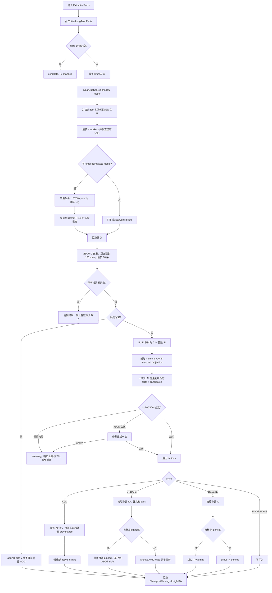

# MEM9 Reconcile 流程

Reconcile 的职责是把“新抽取的长期事实”与“当前已有的 active insight/pinned 记忆”放到同一个决策上下文中，决定每条事实应当 ADD、UPDATE、DELETE 还是 NOOP，并以防重复、可追溯、可恢复的方式执行结果。

## 详细流程图



## 1. 为什么 Reconcile 先检索

如果每个新事实都直接 ADD，重复表达会不断产生近似 insight，冲突事实也无法替换旧状态。因此系统先针对每条 fact 检索相关的 active `insight,pinned`，再把新旧信息交给一次批量 LLM 判断。

`NearDupSearch` 当前只记录最近邻余弦分数作为 shadow metric，不会据此直接删除或抑制事实。真正的动作仍由后续检索与 Reconcile 决策完成。

## 2. 已有记忆候选召回

每条事实最多取 5 个候选，最多 4 个 worker 并发执行。存在自动嵌入模型时使用 `AutoVectorSearch`；存在外部 embedder 时先生成向量再执行 `VectorSearch`；两者都没有时只走 FTS 或 LIKE keyword。

有向量能力时，向量 leg 和 FTS/keyword leg 都会尝试。向量结果低于 0.3 相似度会被丢弃，keyword 结果不应用这个阈值。所有 facts 的候选随后按 UUID 去重，传给 LLM 的正文最多 150 rune，总候选最多 60 条。

单个 fact 的一条检索 leg 失败可以容忍，另一条成功仍可继续。若所有检索尝试都失败，系统返回错误并停止写入，避免把本应 UPDATE/NOOP 的事实静默 ADD 成重复记忆。FTS 候选窗口被截断也被视为不完整检索并阻止继续。

如果检索成功但确实没有任何候选，系统不再调用 Reconcile LLM，而是执行 `addAllFacts`，逐条新增 insight。

## 3. LLM 决策模型

真实 UUID 不直接暴露给 LLM。服务先把候选映射成从 0 开始的整数 ID，并保存整数到 UUID 的本地映射，以阻止模型编造可写目标。每条候选还带有相对 age；age 只能在同一实体、同一属性槽发生冲突时作为辅助判断，不能单独触发 UPDATE 或 DELETE。

四个动作的语义如下：

| 动作 | 条件 | 数据库结果 |
| --- | --- | --- |
| `ADD` | 新信息不存在，或同一实体的新属性 | 新建 active insight |
| `UPDATE` | 同一实体的同一属性槽被新信息取代 | 旧 insight archived，新 insight active |
| `DELETE` | 新事实明确否定旧记忆 | 旧 insight state 变为 deleted |
| `NOOP` | 已有记忆已经覆盖等价信息 | 不写入；正常输出中通常省略该项 |

例如，已有“Sarah 是我的姐姐”，新事实“Sarah 住在大阪”是同一实体的新属性，应 ADD；已有“住在北京”，新事实“住在上海”命中同一实体的同一 location 槽，才适合 UPDATE。

## 4. 决策输出的保护措施

LLM 调用失败、修复重试失败或 JSON 最终无法解析时，系统返回 warning 并跳过全部动作。这里选择“宁可暂时不写，也不盲目写重复或错误记忆”。

所有 UPDATE/DELETE 都必须引用范围内的整数 ID，服务再通过 `idMap` 解析真实 UUID。ID 越界、正文为空或映射不存在时，该动作会被跳过。

Pinned 记忆受额外保护：Reconcile 不会自动删除 pinned；针对 pinned 的 UPDATE 会退化成新增一个 insight，而不是修改用户显式固定的内容。

未知 event 只记录 warning 日志，不执行写入。`NOOP` 和 `NONE` 都明确不产生数据库动作。

## 5. UPDATE 为什么采用版本链

Reconcile 的 UPDATE 不会原地改写旧 insight。`updateInsight` 生成新 UUID，在同一个数据库事务中把旧记录设为 `archived` 并写入 `superseded_by=newID`，随后创建 version=1 的新 active insight。

这种 append-new + archive-old 模型保留了变化历史，也避免读取方在更新中途看到“旧记录已归档但新记录尚未创建”的不完整状态。事务任一步失败都会回滚。

## 6. Provenance 与时间 metadata

ADD/UPDATE 前会移除只读的 `[time: ...]` 投影，并重新生成结构化 temporal metadata。随后把与该 Reconcile 文本最匹配的 `source_seqs`、`source_turns` 和外部 provenance 合并到 metadata 中。

UPDATE 默认沿用旧记忆 tags；只有 LLM 明确返回 tags 时才替换。旧 metadata 会作为时间与来源合并的基础，避免丢失必要的追踪信息。

## 7. 结果状态

`Changes` 记录实际执行成功的 add/update/delete；`InsightIDs` 只包含 ADD 和 UPDATE 产生的新 active ID。`MemoriesChanged` 按 `InsightIDs` 计数，因此 DELETE 不增加这个字段。

存在 warning 且没有任何新 insight ID 时，结果为 `partial`；Reconcile 发生不可恢复错误时为 `failed`；否则为 `complete`。某些动作失败不会回滚已经成功的其他动作，因为动作遍历目前不是一个跨事件总事务。

## 8. 核心伪代码

```text
facts = keep_only_durable(facts)[:50]
for fact in facts: observe_near_duplicate_score(fact)

existing = parallel_search(facts, pools=[insight, pinned])
if every_search_attempt_failed: abort
if existing.empty: return add_all(facts)

refs, id_map = map_uuids_to_integer_ids(existing)
events = llm.reconcile(refs_with_age, facts_with_temporal_projection)
events = parse_or_retry(events)
if parse_failed: return warning_without_writes

for event in events:
  ADD    -> create_active_insight()
  UPDATE -> pinned ? create_active_insight() : archive_old_and_create_new_tx()
  DELETE -> pinned ? skip_with_warning : set_state_deleted()
  NOOP   -> do_nothing()
```

## 9. 源码定位

- `server/internal/service/ingest.go`: `ReconcilePhase2`、`reconcile`、`gatherExistingMemories`、`searchExistingMemoriesForFact`、`addAllFacts`、`addInsight`、`updateInsight`。
- `server/internal/repository/tidb/memory.go`: `ArchiveAndCreate`、`SetState`、向量/FTS/keyword 查询。
- `server/internal/service/source_provenance.go`: Reconcile 输出文本到来源 facts 的重新关联。

## 10. 排障检查点

- 重复记忆增加时，先确认是“搜索成功但零候选”还是“检索结果漏召回”，不要只检查 LLM 输出。
- Reconcile 没有写入时，区分全部 NOOP、LLM/JSON warning、动作 ID 无效、pinned 保护和单动作数据库失败。
- UPDATE 后查询不到旧 ID 是预期行为，因为 `GetByID` 只读取 active；应检查旧行是否 archived 且 `superseded_by` 指向新 ID。
- `MemoriesChanged=0` 不代表完全没有状态变化，DELETE 可能已成功但不会进入 `InsightIDs` 计数。
